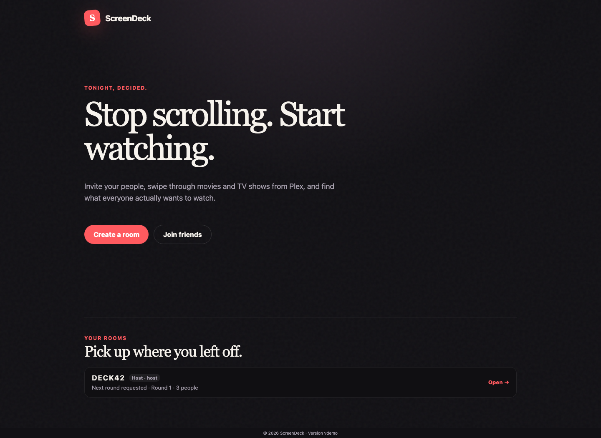
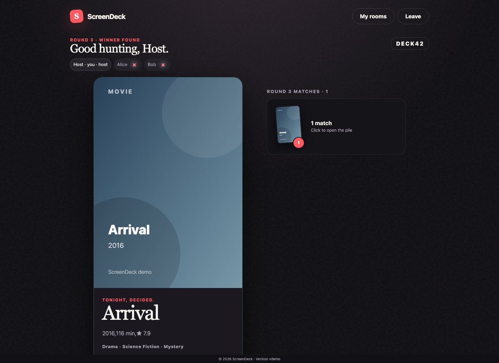

<p align="center">
  
</p>

<p align="center">
  <strong>Stop scrolling. Start watching.</strong><br />
  A self-hosted Plex picker that helps a group agree on a movie or TV show.
</p>

<p align="center">
  <a href="docs/content/assets/screenshots/home.png">
    
  </a>
  <a href="docs/content/assets/screenshots/room.png">
    
  </a>
  <a href="docs/content/assets/screenshots/winner.png">
    
  </a>
</p>

ScreenDeck turns your Plex libraries into a shared swipe deck. Create a room, invite your friends, and swipe independently. A title becomes a match when everybody likes it, so the group only needs to discuss choices that already work for everyone.

Rooms you create or join are remembered for the current browser profile. Return later, switch between active rooms from **Your rooms**, and continue as the same participant without joining again.

## How it works

1. **Connect Plex** and choose the movie and TV libraries you want to use.
2. **Create a room** with optional filters, genres, a first-round size, and a sampling strategy.
3. **Share the room code** so friends can join from their phones or browsers.
4. **Swipe independently** without seeing or influencing each other's votes.
5. **Collect unanimous matches** and ask the group to narrow them into another round whenever you are ready.
6. **Return later or switch rooms** from **Your rooms** without joining again while the room is still active.
7. **Repeat until one title wins.**

## Highlights

- Movies and top-level TV shows from your own Plex libraries, with optional server-wide library exclusions.
- Room filters for genres, years, movie length, and watched state.
- Optional personal genre preferences for every participant.
- First-round limits for large libraries, with several sampling strategies.
- Add more unseen titles without starting over.
- Unanimous matches and unanimous next-round requests.
- Live room updates, match reveals, a compact match pile, and a dedicated winner screen.
- Persistent **Your rooms** history per browser, so you can switch between active rooms and resume the same participant without rejoining.
- No guest accounts: friends only need a room code and a display name.

## Quick start

Copy the example environment file and set the address your friends will use to open ScreenDeck:

```sh
cp .env.example .env
```

Then start it with Docker Compose:

```sh
docker compose -f deploy/compose.yaml up -d
```

Open ScreenDeck, choose **Connect Plex**, approve the Plex login, and select your server. After that, create a room and share its six-character code.

For Kubernetes and other deployment details, see the [deployment guide](https://gi8lino.github.io/screendeck/deployment/).

## Common settings

Environment variables use the `SCREENDECK__` prefix.

| Setting                         | Default                 | What it changes                                        |
| ------------------------------- | ----------------------- | ------------------------------------------------------ |
| `SCREENDECK__BASE_URL`          | `http://localhost:8080` | Public URL used for room invitation links.             |
| `SCREENDECK__LISTEN_ADDRESS`    | `:8080`                 | Address and port ScreenDeck listens on.                |
| `SCREENDECK__EXCLUDE_LIBRARIES` | empty                   | Plex library titles or keys hidden from room creation. |
| `SCREENDECK__ROOM_TTL`          | `24h`                   | How long rooms and saved memberships remain available. |
| `SCREENDECK__EXPERIMENTAL`      | `false`                 | Enables experimental features such as Plex JWT auth.   |

See the [configuration guide](https://gi8lino.github.io/screendeck/configuration/) for every setting and command-line flag.

## Documentation

The full documentation is published at:

**[gi8lino.github.io/screendeck](https://gi8lino.github.io/screendeck/)**

## License

ScreenDeck is licensed under the [Apache License, Version 2.0](LICENSE).
