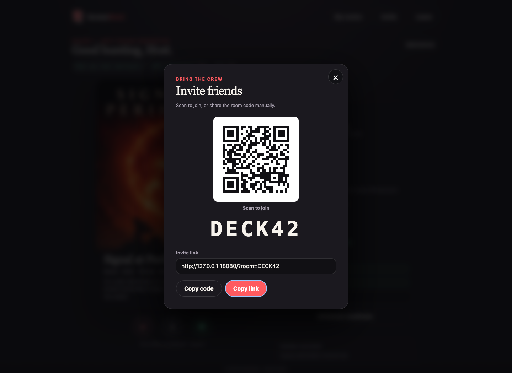
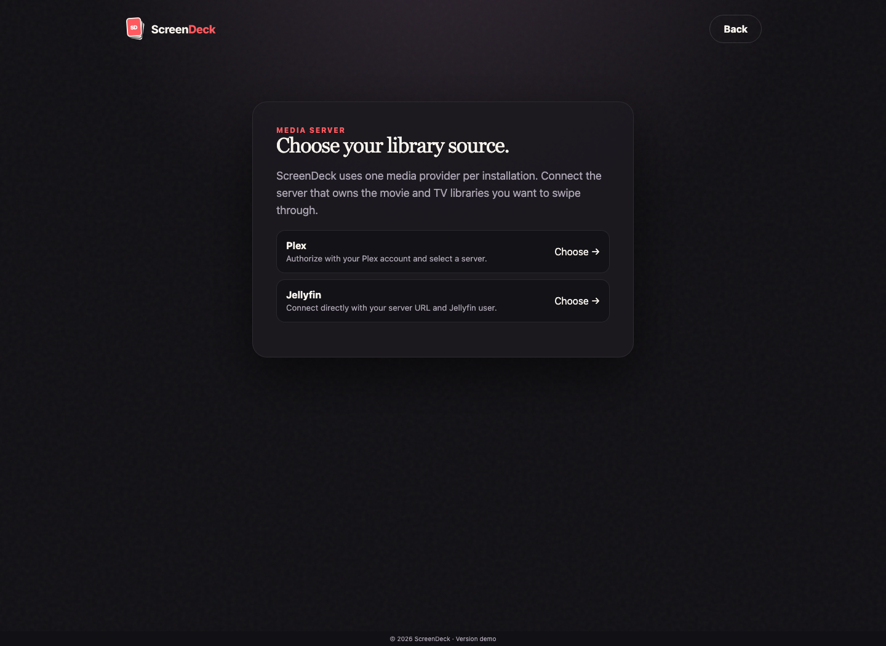
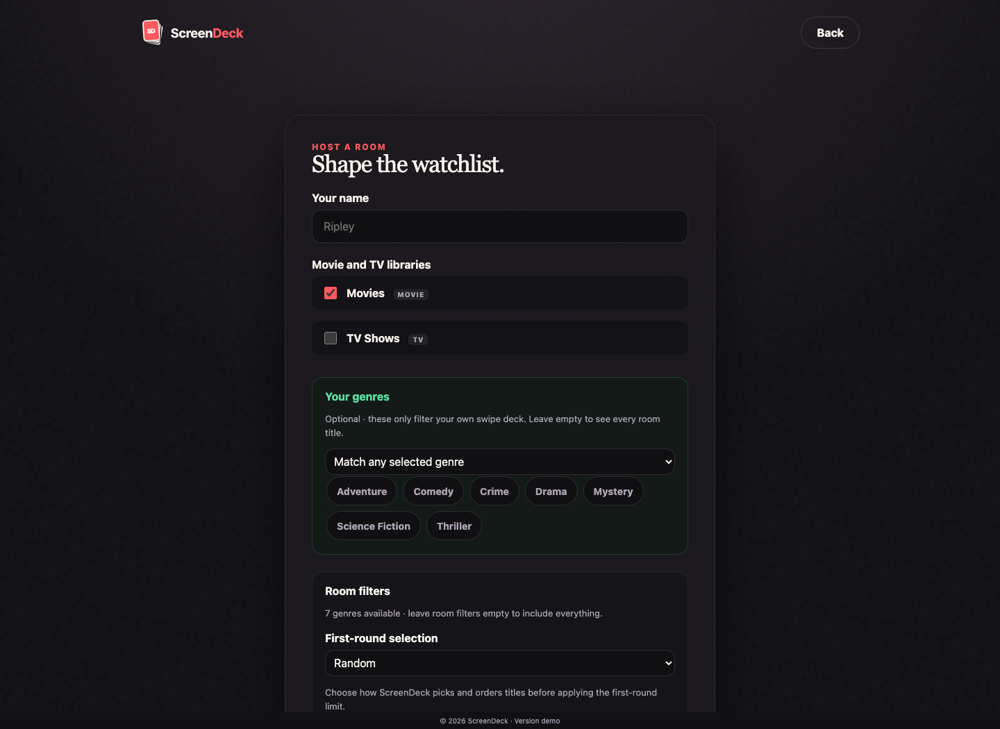

# ScreenDeck documentation

{width=480}

ScreenDeck is a self-hosted Plex and Jellyfin picker that helps a group agree on a movie or TV show. Create a room, invite friends, swipe independently, and keep narrowing unanimous matches until one title wins.

{width=100%}

{width=100%}

{width=100%}

{width=100%}

!!! info
Start with [Deployment](deployment/index.md) to run ScreenDeck, then check [Configuration](configuration/index.md) for the settings you can customize.

## Saved rooms

Rooms you create or join are remembered for the current browser profile while they remain active.

When you return to ScreenDeck, the startup page lists those memberships under **Your rooms**. Opening a saved room restores the same participant instead of creating a new one, so existing votes, host status, and room progress continue normally.

Saved rooms are tied to the current browser profile, not to a ScreenDeck account. They do not automatically sync to another browser, profile, or device. A membership disappears from **Your rooms** when you leave the room, the host removes you, or the room expires.

## Documentation

- **[Configuration](configuration/index.md)** — Environment variables, command-line flags, room lifetime, saved-room behavior, logging, and media-provider settings.
- **[Deployment](deployment/index.md)** — Run ScreenDeck with Docker Compose or Kubernetes and keep its SQLite data, browser memberships, and encryption key persistent.
- **[Security](security/index.md)** — Understand media-provider credential storage, browser identities, resumable room sessions, backups, logs, and network exposure.
- **[Development](development/index.md)** — Build, test, format, generate screenshots, and work on the documentation site locally.
