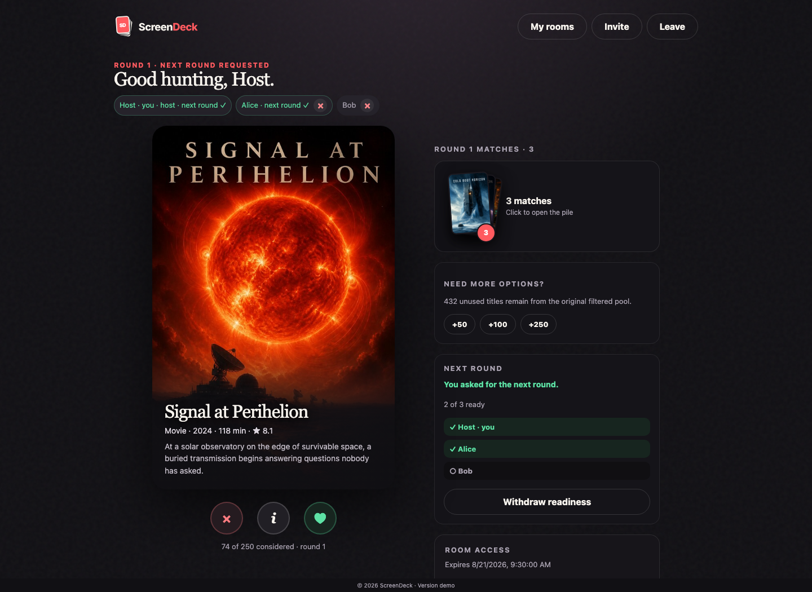

---
hide:
  - navigation
  - toc
---

  

# ScreenDeck documentation

ScreenDeck is a self-hosted Plex picker that helps a group agree on a movie or TV show. Create a room, invite friends, swipe independently, and keep narrowing unanimous matches until one title wins.

  

!!! tip "New to ScreenDeck?"
    Start with [Deployment](deployment/index.md) to run ScreenDeck, then check [Configuration](configuration/index.md) for the settings you can customize.

## Saved rooms

Rooms you create or join are remembered for the current browser profile while they remain active.

When you return to ScreenDeck, the startup page lists those memberships under **Your rooms**. Opening a saved room restores the same participant instead of creating a new one, so existing votes, host status, and room progress continue normally.

Saved rooms are tied to the current browser profile, not to a ScreenDeck account. They do not automatically sync to another browser, profile, or device. A membership disappears from **Your rooms** when you leave the room, the host removes you, or the room expires.

## Documentation

- :material-cog-outline:{ .lg .middle } **Configuration**

  ***

  Environment variables, command-line flags, room lifetime, saved-room behavior, logging, and Plex overrides.

  [:octicons-arrow-right-24: Configure ScreenDeck](configuration/index.md)

- :material-server-outline:{ .lg .middle } **Deployment**

  ***

  Run ScreenDeck with Docker Compose or Kubernetes and keep its SQLite data, browser memberships, and encryption key persistent.

  [:octicons-arrow-right-24: Deployment guide](deployment/index.md)

- :material-shield-lock-outline:{ .lg .middle } **Security**

  ***

  Understand Plex credential storage, browser identities, resumable room sessions, backups, logs, and network exposure.

  [:octicons-arrow-right-24: Security notes](security/index.md)

- :material-code-braces:{ .lg .middle } **Development**

  ***

  Build, test, format, generate screenshots, and work on the documentation site locally.

  [:octicons-arrow-right-24: Development guide](development/index.md)

